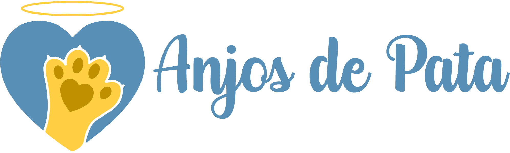
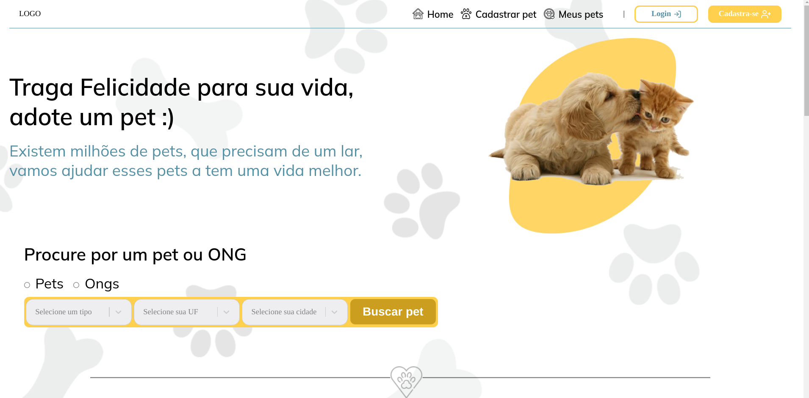
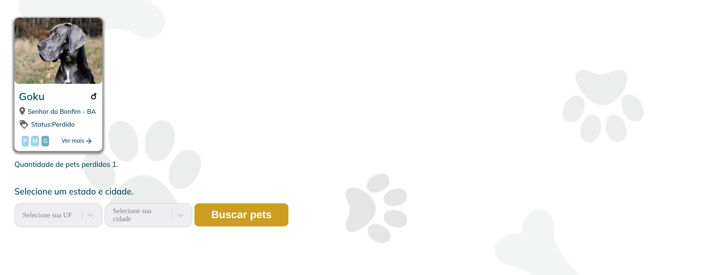
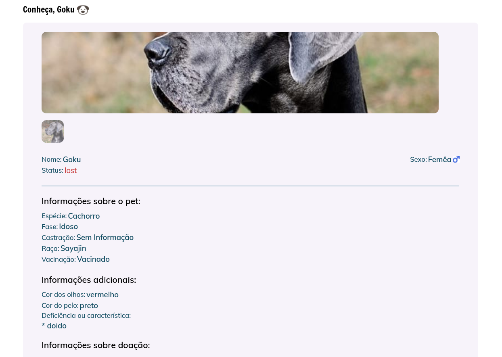

<h1 align="center">
  
</h1>


<h4 align="center">
	🚧  Legged Angels 🚀 em desenvolvimento 🚧
</h4>

<br/>

<p align="center">
 <a href="#sobre-o-projeto">Sobre o projeto</a> •
 <a href="#funcionalidades">Funcionalidades</a> •
<a href="#layout">Layout</a> •
 <a href="#como-executar-o-projeto">Como executar o projeto</a> •
 <a href="#tecnologias">Tecnologias</a> •
 <a href="#contribuidores">Contribuidores</a> •
 <a href="#autor">Autor</a> •
<a href="#licenc-a">Licença</a> •
</p>
<br/>

## Sobre o projeto

<p align="left"> O <strong>Legged Angels </strong>foi desenvolvido com a intenção de ajudar pets (animais de estimação como cachorro e gato)
que estão em situação de vulnerabilidade a encontrarem um novo lar. Tanto pessoas como ONGS podem cadastrar esse pet.</br>
Além disso, o Legged Angels, permite que pessoas possam encontrar seu pet perdido, fazendo o cadastro dele ou encontrando no sistema se já tiver sido cadastrado com o status de perdido por outra pessoa. É também possível visualizar ONGS na sua região através do mapa na nossa página inicial.

</p> 

---

##  Funcionalidades

- [x] Exibir ONGs próxima;
- [x] Cadastro de pets:
  - [x] Perdidos.
  - [x] Para adoção;
- [x] Exibir informações sobre o pet;
- [x] Exibir informações sobre o dono do pet ou ONGs.
---

## Layout

<h1>Versão web</h1>
<p align="center" >
  </br>
  </br>
  </br>
  
</p>

---
## Como executar o projeto

### Pré-requisitos

Antes de começar, você vai precisar ter instalado em sua máquina as seguintes ferramentas:
[Git](https://git-scm.com) é um editor para trabalhar com o código como [VSCode](https://code.visualstudio.com/)

#### 🎲 Rodando o projeto

```bash

# Clone este repositório
$ git clone git@github.com:andersonzeroone/legged-angels.git

# Acesse a pasta do projeto no terminal/cmd
$ cd legged-angels

# Instale as dependências
$ npm install ou yarn install

# Execute a aplicação
$  npm start ou yarn start

# O projeto iniciará na porta:3333 - acesse http://localhost:3333
```

---
##  Tecnologias

As seguintes ferramentas foram usadas na construção do projeto:

#### **Mobile**  ([React](https://pt-br.reactjs.org/)  +  [TypeScript](https://www.typescriptlang.org/))

-   **[React Navigation](https://reactnavigation.org/)**
-   **[Axios](https://github.com/axios/axios)**
-   **[Leaflet](https://leafletjs.com/)**
-   **[React Select](https://react-select.com/home)**
-   **[Yup](https://www.npmjs.com/package/yup)**


> Veja o arquivo  [package.json](https://github.com/andersonzeroone/legged-angels/blob/main/package.json)

**Utilitários**

-   Editor:  **[Visual Studio Code](https://code.visualstudio.com/)**

---
## Contribuidores

💜 Um super thanks 👏 para essa galera que fez esse produto sair do campo da ideia e entrar nas lojas de aplicativos :)

## Como contribuir para o projeto

1. Faça um **fork** do projeto.
2. Crie uma nova branch com as suas alterações: `git checkout -b my-feature`
3. Salve as alterações e crie uma mensagem de commit contando o que você fez: `git commit -m "feature: My new feature"`
4. Envie as suas alterações: `git push origin my-feature`
> Caso tenha alguma dúvida confira este [guia de como contribuir no GitHub](./CONTRIBUTING.md)

---

##  Autor
</br>

<a href="https://github.com/andersonzeroone">
 
 <br />
 <br />
 <sub><b>Anderson Pablo</b></sub></a> <a href="https://www.linkedin.com/in/anderson-pablo-js/" title="andersonPablo">🚀</a>
 <br />


 [](https://www.linkedin.com/in/anderson-pablo-js/)
[](mailto:anderson.pablo02@gmail.com)

---

## Licença

Este projeto está sob a licença [MIT](./LICENSE).

Feito com ❤️ por Anderson Pablo 👋🏽 [Entre em contato!](https://www.linkedin.com/in/anderson-pablo-js/)

---

<!-- ##  Versões do README

[Português 🇧🇷](./README.md)  |  [Inglês sem emojis 🇺🇸](./README-en.md) | [Portugues sem logo  🇧🇷](./README-sem-logo.md)  -->
